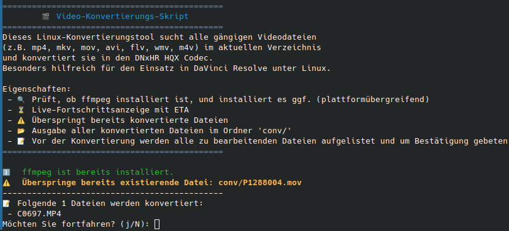
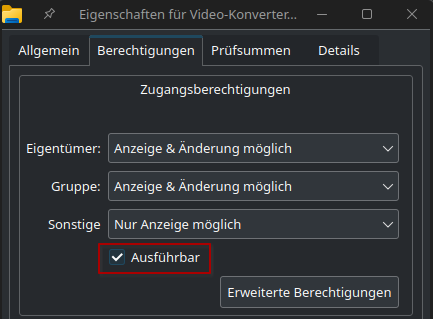
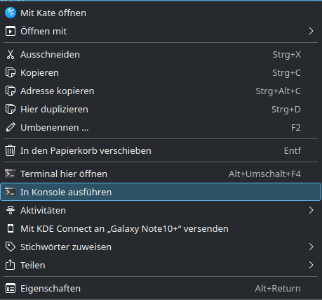
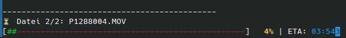

# 🎬 Linux Video-Konvertierungs-Skript

**Autor:** Felix Lenz  
**Unterstützt durch:** ChatGPT als Hilfstool  

Wenn man die Standard Linux Version von Davinci Resolve nutzt (also die kostenlose) werden die Video Codecs H264 und H265 nicht unterstützt. Deshalb habe ich mein Videomaterial 
in den DNxHR HQX Codec umgewandelt, um das Material unter Linux in Davinci Resolve nutzen zu können. Dieser Codec ist für die Post Production gedacht und ist deshalb geringer kompremiert als z.B. H264.
Vorteil davon ist, dass auch auf nicht so leistungsstarker Hardware geschnitten werden kann. Nachteil, die konvertierten Dateien 
**sind sehr groß!**

Dieses Linux-Konvertierungstool sucht alle gängigen Videodateien (z.B. mp4, mkv, mov, avi, flv, wmv, m4v) im aktuellen Verzeichnis und konvertiert sie **in den DNxHR HQX Codec**.  
Es ist besonders hilfreich für den Einsatz in **DaVinci Resolve unter Linux**.  
Das Skript zeigt eine Live-Fortschrittsanzeige, überspringt bereits konvertierte Dateien und gibt am Ende eine Gesamtstatistik aus.



---

## 🚀 Features

- Prüft, ob ffmpeg installiert ist und installiert es ggf. plattformübergreifend
- Live-Fortschrittsanzeige mit ETA pro Datei
- Überspringt bereits konvertierte Dateien
- Ausgabe aller konvertierten Dateien im Ordner 'conv/'
- Vor der Konvertierung werden alle zu bearbeitenden Dateien aufgelistet und um Bestätigung gebeten
- Gesamtstatistik am Ende (konvertierte Dateien, übersprungene Dateien, Gesamtzeit)
- Farbiges Terminal mit Icons für bessere Übersicht

---

## 🔧 Die verwendeten ffmpeg Parameter

| Parameter               | Bedeutung                                       |
| ----------------------- | ----------------------------------------------- |
| `-c:v dnxhd`            | Video-Codec DNxHD                               |
| `-profile:v dnxhr_hqx`  | DNxHR HQX Profil für hohe Qualität              |
| `-pix_fmt yuv422p10le`  | Pixel-Format 10-Bit 4:2:2                       |
| `-b:v 110M`             | Video-Bitrate: 110 Mbit/s                       |
| `-c:a pcm_s16le`        | Audio-Codec PCM 16-Bit Little Endian            |

## 💻 Installation
Lade dir die [Video-Converter.sh](Video-Konverter.sh) (Nach dem Klicken auf den Link oben rechts Download Pfeil) aus dieser GitHub Repo herunter und mache sie entweder über deine GUI ausführbar:



oder über das Terminal:
```
sudo chmod +x Video-Konverter.sh 
```

Bewege die [Video-Converter.sh](Video-Konverter.sh) Datei in den Ordner in dem alle zu konvertierenden Dateien liegen und führe das Skript entweder über die GUI aus:


oder über das Terminal:
```
./Video-Konverter.sh 
```
Progress Bar Beispiel:

---

## 📝 Unterstützte Videoformate
mp4, mkv, mov, avi, flv, wmv, m4v.
Skript berücksichtigt Groß- und Kleinschreibung. .MP4 funktioniert also auch.

---

## 🛠️ Anforderungen
- Linux (Debian/Ubuntu, Fedora/CentOS, Arch, openSUSE) (Ich konnte nur Debian testen, ich bitte um Rückmeldung bei anderen Betriebssystemen :) )
- ffmpeg (https://ffmpeg.org/), verwendet zur Videokonvertierung, unter LGPL/GPL lizenziert (Skript installiert ffmpeg bei Bedarf)
- Bash (Normalerweise mit Terminal unter Linux gegeben)

---
## 📄 Lizenz
MIT License © 2025 Felix Lenz
Siehe LICENSE für Details

---

## ❤️ Hinweise
Dieses Skript ist für den persönlichen und freien Gebrauch gedacht.
Es kann an eigene Bedürfnisse angepasst und erweitert werden.
Ich bin für jedes Feedback und Verbesserungen offen :)

# Das nutzen des Tools geschieht auf eigene Gefahr!
Dieses Skript wurde mit Unterstützung von ChatGPT erstellt. Ich habe zwar selbst den Code überprüft und getestet, doch auch mir können Fehler unterlaufen. Also übernehme ich keine Verantwortung wenn ihr dieses Tools nutzen möchtet.

